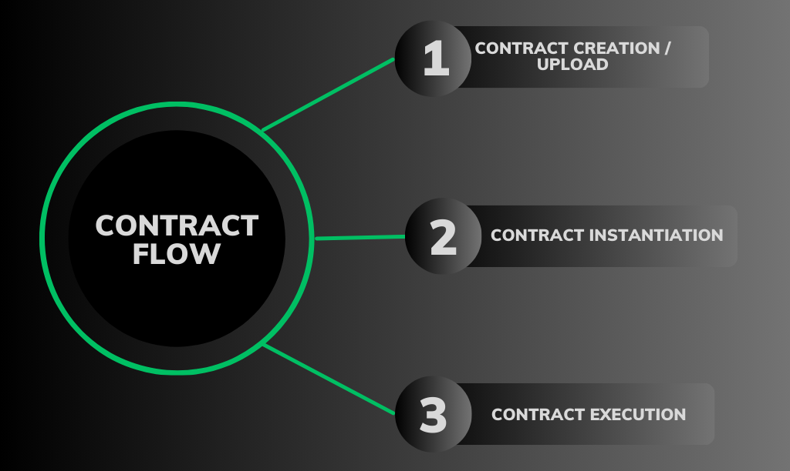

# Smart Contract

In essence, **Smart Contracts** are computer programs stored on a blockchain that may be instantiated and executed to perform custom functions. At its core, it is a piece of code that automates the execution of predefined actions when specific conditions are met. That is to say, these functions are not included in the code of the blockchain itself but are defined in a manner that enables the blockchain to execute them.

## **Key Features of Smart Contracts**

1. **Self-Executing:** Smart contracts automatically execute their predefined instructions when the conditions encoded in the contract are met. This eliminates the need for manual intervention, reducing the risk of errors or disputes.
2. **Trust and Transparency:** Running on a blockchain ensures that the terms and execution of smart contracts are visible to all participants. This transparency builds trust, as the outcome is verifiable and cannot be altered once the contract is deployed.
3. **Decentralization:** Smart contracts operate on a decentralized network, meaning there is no central authority overseeing the execution. This decentralization minimizes the risk of manipulation or censorship.
4. **Immutable:** Once deployed on the blockchain, smart contracts are immutable, meaning their code cannot be altered or tampered with. This ensures the integrity of the contract and the trustworthiness of the executed transactions.

Coreum leverages WebAssembly (WASM) as the engine for Smart Contracts. WASM overcomes many of the shortcomings of other Smart Contract engines such as the Ethereum Virtual Machine, such as security flaws, data oversizing, and the necessary coupling with Solidity, the language in which Smart Contracts are written. Beyond WASM having noteworthy features such as its portability, efficiency, and turing completeness, it can also be accessed through other programming languages including C/C++, JavaScript/Typescript, Rust, Kotlin, and Go.

## CosmWasm 

[CosmWasm](https://cosmwasm.com/) is the platform Coreum uses to handle WASM Smart Contracts.

It forms an important pillar of the Cosmos SDK, and has a number of advantages such as the ability to interact with Smart Contracts on different blockchains using the Inter-Blockchain Communication (IBC) protocol. This enables Smart Contracts stored on Coreum to enhance not only the functionality of Coreum itself, but all other blockchains in the Cosmos ecosystem that are compatible with CosmWasm Smart Contracts.

## Architecture 

CosmWasm Smart Contracts produce and consume messages. These messages follow what is commonly referred to as the [actor model](https://dspace.mit.edu/handle/1721.1/6952), which means that they behave in a 'fire and forget' manner.

In effect, these messages are designed to be synchronous in nature, this avoiding race-conditions and pitfalls of awaiting promises. Other advantages of this model are:

* **Increased Security** - Since Smart Contracts are unable to call each other, it avoids re-entrance attacks. Messages may be passed between contracts, but they cannot directly call one another.
* **Inter-Blockchain Messaging** - Messages can be sent across blockchains through the IBC.
* **Ease of Serialisation** - Messages can be easily serialized to a number of different formats for easy integration with off-chain systems.

## Contract Flow 

<figure><figcaption>
Smart Contract Lifecycle
</figcaption></figure>

The lifecycle of a Smart Contract can be split into three distinct phases:

### Contract Creation / Upload 

Once the code for a Smart Contract is compiled into WASM binaries, they are optimised and uploaded to the blockchain. However, neither state nor a contract addresses exist at this stage.

### Contract Instantiation 

The contract may then be instantiated with through a code reference as well as some initial state. This creates the address which identifies the contract. For reference, if this were an ERC20 Token Contract on an Ethereum Virtual Machine (EVM) blockchain, this is the stage at which information like the token name, symbol, etc. can be set.

### Contract execution 

Each actor has exclusive access to its own internal state. This may support different calls, but they are all unprivileged; usage of previously instantiated contracts depends on the contract design.

## CosmWasm Module 

Coreum makes use of a custom module for the purpose of processing WASM related messages in order to upload, instantiate, and execute Smart Contracts.

## Rust Language 

Although Smart Contracts may be written in a number of different languages as stated above, Rust remains the language of choice. This is due to Rust's characteristic memory model, which promotes the creation of memory-safe, fast, and lightweight byte code that is ideal for on-chain storage.

\

\
