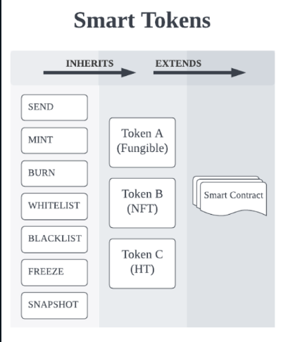

# Smart Token

Smart tokens are natively issued tokens on the Coreum chain that are wrapped around Smart Contracts. They are highly customizable and are designed to be lightweight and flexible while remaining extendible.

These tokens exist in the chain’s storage and memory; hence, interacting with them does not require calling Smart Contract functions. We can refer to Smart Tokens as objects and classes that inherit a set of characteristics and functions from the global definition of a token. All tokens have a set of features that are known to the chain. Developers can extend the set of provided functionality and add non-deterministic Smart Contract-like functions to achieve greater flexibility when developing specific use cases into a token.

Regardless of their type, all tokens share common functions such as minting, sending, burning, and so on. The list of default functions is picked from the real use cases of the current DeFi systems, and as the chain progresses, this list will expand to support more features.

Currently, the following set of features is available for all Smart Tokens:

* [Issuance (Minting)](https://docs.coreum.dev/overview/smart-tokens.html#issuance)
* [Access Control List (ACL)](https://docs.coreum.dev/overview/smart-tokens.html#access-control-list)
* [Burning](https://docs.coreum.dev/overview/smart-tokens.html#burning)
* [Freezing and Global Freezing](https://docs.coreum.dev/overview/smart-tokens.html#freezing)
* [Whitelisting](https://docs.coreum.dev/overview/smart-tokens.html#whitelisting)
* [Block Smart Contracts](https://docs.coreum.dev/overview/smart-tokens.html#block-smart-contracts)
* [Burn Rate](https://docs.coreum.dev/overview/smart-tokens.html#burn-rate)
* [Send Fee](https://docs.coreum.dev/overview/smart-tokens.html#send-fee)
* [IBC (Inter Blockchain Communication) compatibility](https://docs.coreum.dev/overview/smart-tokens.html#ibc-compatibility)
* [Smart Contract integration](https://docs.coreum.dev/overview/smart-tokens.html#smart-contract-integration)

Upon token issuance, the issuer must configure the behaviour of the token and set specific flags that will determine which functions can be triggered at a later stage.

These flags are set using the ACL and are as follows:


```shell
can_mint 
can_burn 
can_whitelist 
can_partial_freeze 
can_global_freeze 
can_send 
token_transferrable_using_ibc
block_sending_to_smart_contracts
```


These flags remain immutable after token issuance and cannot be changed at a later stage.

Depending on the token type, these flags can be used to customize what asset needs to be represented by the token. For example, Stablecoins, Crypto, NFT, Stocks, CBDCs and so on.

Once a token is issued, and depending on the flags, network participants, such as issuers or users can interact with these tokens using the features provided.

It is imperative to understand the importance of natively issued tokens and default functions in terms of speed, cost-efficiency, predictability, security, and extendibility.

## Importance of Natively Issued Tokens

### **Speed**

As mentioned earlier, calling functions of Smart Contracts can be tricky as they rely on the parent Smart Contract execution which is unknown. However, natively issued tokens are predictable and the code execution is known to the chain. This makes transactions such as sending Smart Tokens much faster with Smart Tokens.

### **Cost-efficiency**

Interacting with Smart Tokens costs much less than interacting with Smart Contracts. The fees are always set according to a “known” computational complexity. These transactions are no longer dependent on the amount of gas offered by the caller, but rather are fixed, resulting in a more robust and predictable interaction and management.

When fees are always known, users such as institutions, governments and other DeFi applications can predict how to handle batches of transactions. In addition, the Coreum blockchain offers a discount for bulk transaction submissions, similar to how SaaS-based APIs work with a fee per API call and usage.

### **Predictability**

When execution time, cost and responses are known for a transaction, users can develop much more robust, bug-free and stable applications. Responses from the chain, whether successful or unsuccessful are known and can be handled properly by the developers.

### **Security**

One of the main aspects of issuing tokens natively on the Coreum Blockchain is security. When using Smart Contracts, a developer must audit the code of the contract to ensure there are no security vulnerabilities. Over the past few years, hundreds of exploits have been found and abused in Smart Contracts resulting in billions of dollars of losses to the operators and users.

Smart Tokens are not prone to these exploits because the code is known to be the same for all tokens on the chain. The code for the main implementation is audited several times and is open by the public as open-source code to be inspected and audited. Although, an extension to the Smart Token which comes in the form of a Smart Contract must still be audited by the user. But the majority of the current use cases on the Blockchain such as fungible tokens and basic NFTs can remain risk-free.

### **Extendibility**

Smart Tokens can be exposed to Smart Contracts for greater customization. Other than the basic features such as sending coins and minting which are provided by the chain by default, the Smart Contract functions attachment can define a set of new logic and features for a token. For example, one can develop dividend functions in a token that represents shares of a company. Or an NFT can be extended to become interactive with the owner, such as an NFT that can act like a game.

Since Coreum uses WASM as its Smart Contract engine, developers can easily port and add functionalities developed in several languages and attach them to their digital assets.

<figure><figcaption><p>Smart Tokens Inheriting Default Functionalities</p></figcaption></figure>

## Features <a href="#features" id="features"></a>

### Issuance <a href="#issuance" id="issuance"></a>

Asset issuance is the initial phase of the asset lifecycle. On issuance, the issuer defines the asset settings, initial amount, allowed features, and default Access Control List. After the creation, the initial amount will be minted for the provided recipient and sent to the corresponding account. The allowed features are the asset features, which can be used with the asset but can't be changed after the issuance. Meaning, if you set no features, you won't be able to use any of them.

### Minting <a href="#minting" id="minting"></a>

Tokens can be initially minted on asset instantiation or on the fly if the can\_mint feature flag is set at the issuance level. This feature is useful for a wide variety of use cases, such as CBDCs, Stablecoins, Tokenized Securities, Wrapped Crypto Currencies and so on. If a token gives up the ability to mint at the time of issuance, it can never mint more tokens and the total supply of the token will not ever increase.

### Access Control List <a href="#access-control-list" id="access-control-list"></a>

The ACL(Access Control List) provides a flexible way for asset administration and is the relationships of the chain accounts and allowed features set on the asset issuance. The administrators might be set in the same ACL.\
Example of the ACL:


```shell
can_administrate: account1
can_partial_freeze: account2
can_mint: account3, account4
can_burn: all
```


### Burning <a href="#burning" id="burning"></a>

When this feature is enabled on a token, then the holders of the token who have the right permission will be able to burn some of the tokens they hold to reduce the total supply of that token. To give an example use case, if shares of a company are tokenized, then the total supply will represent the total shares of the company on the chain. And burning those tokens would mean those shares are now moved out of the blockchain and total supplies will correctly represent that fact.

### Freezing <a href="#freezing" id="freezing"></a>

If this feature is enabled when the token is first issued, freezing allows the administrator of the token to freeze a portion of or the balance of the token held by a user. There are many use cases that are enforced by law to freeze a token. An example use case is when the token administrator sends tokens to an address but does not want the user to spend them until some time has passed such as clearing a cheque.

Token might be frozen globally. It means that it might be transferred only to the issuer. All the other transfers are rejected until it is unfrozen back.

### Whitelisting <a href="#whitelisting" id="whitelisting"></a>

Whitelisting is designed to support scenarios when, due to KYC/AML or any other policy enforced by the issuer, the Smart Token might be held by a limited scope of accounts that passed the verification procedure. Its possible use cases include tokens representing stock shares, CBDC or any other rights enforced by the legal system where the identity of the holder must be confirmed.

If the can\_whitelist flag is enabled on the Smart Token, the issuer defines the list of accounts (addresses) that are allowed to receive that token. If an account is not on that list and someone tries to send tokens to it, the transfer is rejected. Alternatively, a special flag whitelist\_everyone may be set to true to whitelist all the accounts. If whitelisting was enabled during Smart Token issuance, the issuer may update the list of whitelisted accounts and enable or disable the whitelist\_everyone flag at any time.

If an account holding the token is removed from the whitelist, its current balance stays unaffected but it cannot receive tokens anymore until whitelisted back.

### Block Smart Contracts <a href="#block-smart-contracts" id="block-smart-contracts"></a>

Blocking Smart contracts is a feature that allows the issuer to block the transfer of the Smart Token to a Smart Contract. This feature is useful for tokens that are not meant to be used in Smart Contracts. For example, an issuer might want to block the transfer of a token that is not meant to be used in a DeFi application.

### Burn Rate <a href="#burn-rate" id="burn-rate"></a>

When a token is issued, it is possible to define Burn Rate. It is a number between 0 and 1, defining the portion of transferred amount to be burnt. The burnt amount is charged on the sender in addition to the original amount being transferred.

Burn Rate is not applied on transfers sent or received by the token issuer.

### Send Fee <a href="#send-fee" id="send-fee"></a>

Similarly to Burn Rate, the issuer may define a Send Fee. It is a number between 0 and 1 too, which defines the portion of transferred amount which is sent to the issuer. This tax is charged on the sender in addition to the original amount.

Send Fee is not applied on transfers sent or received by the token issuer.

### IBC compatibility <a href="#ibc-compatibility" id="ibc-compatibility"></a>

Assets are based on the Cosmos SDK modules and extend the Cosmos IBC (Inter Blockchain Communication) capability. Hence, they can be transferred to and from IBC-supported chains within the cosmos ecosystem or outside it given proper relayers are present. When an asset is transferred to another chain, it’s represented as a tokenized version of the underlying asset in the Coreum Blockchain.

### Smart Contract integration <a href="#smart-contract-integration" id="smart-contract-integration"></a>

An integral part of the Coreum blockchain is to support the deployment and execution of Smart Contracts, which already bring countless possibilities. By implementing Smart Tokens, Coreum is able to extend their functionalities and flexibility through Smart Contracts.

Developers can deploy their own logic by writing Smart Contracts, being able to issue Smart Tokens, mint and burn them, whitelist and blacklist accounts, freeze and unfreeze their balances, and block or allow sending them to other smart contracts.

Now the behavior of the Smart Token might be driven by actions taken by ordinary people, departments of your organization or even different ones cooperating together, meaning that the final action taken on the Smart Token might be the result of the process involving different actors following the transparent logic provided by the Smart Contract, leading to greater reliability.
